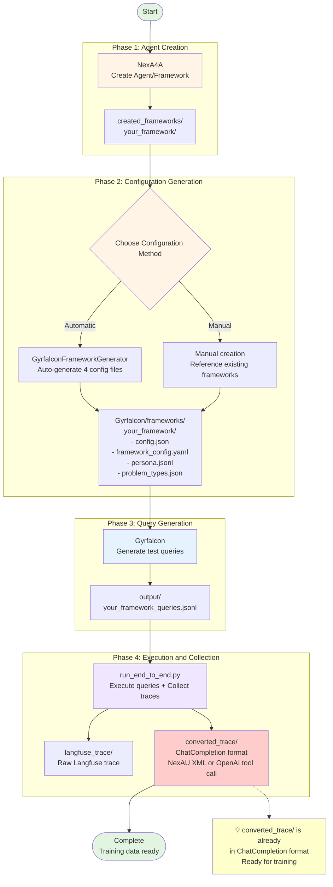
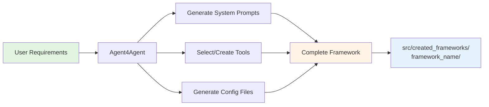
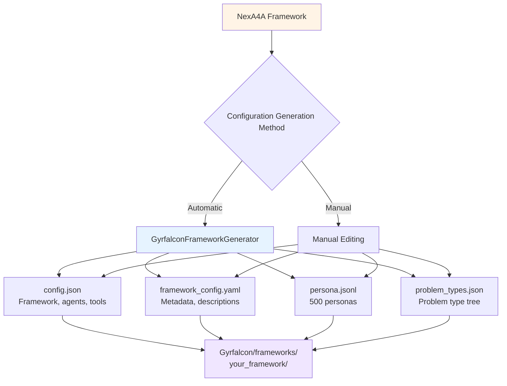
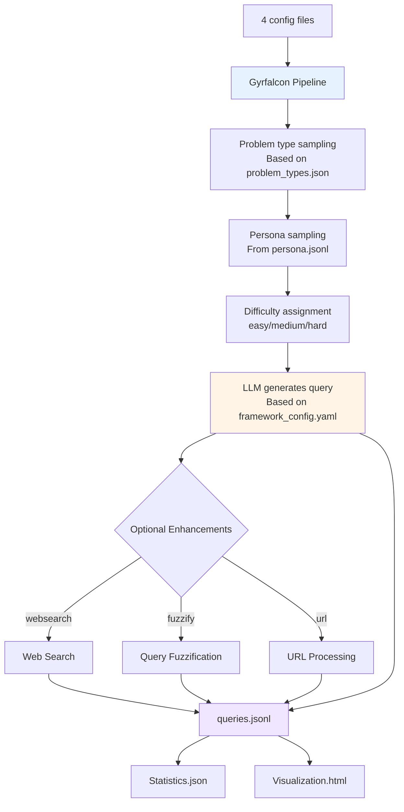
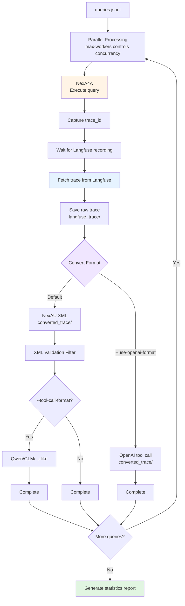
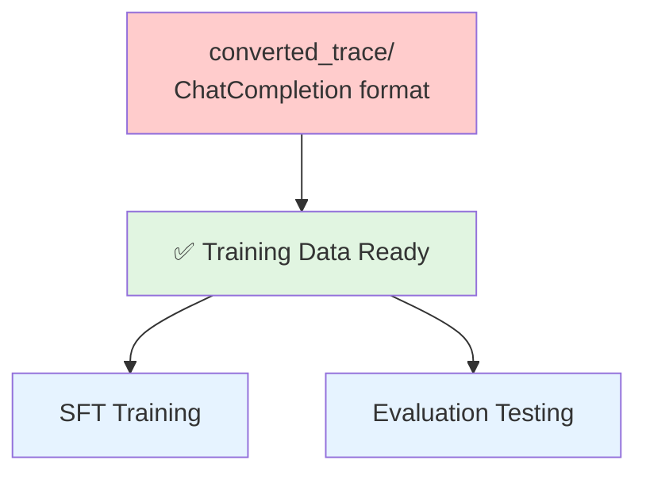
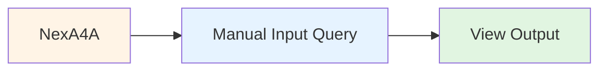
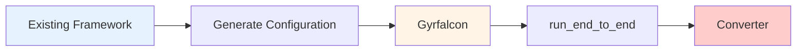
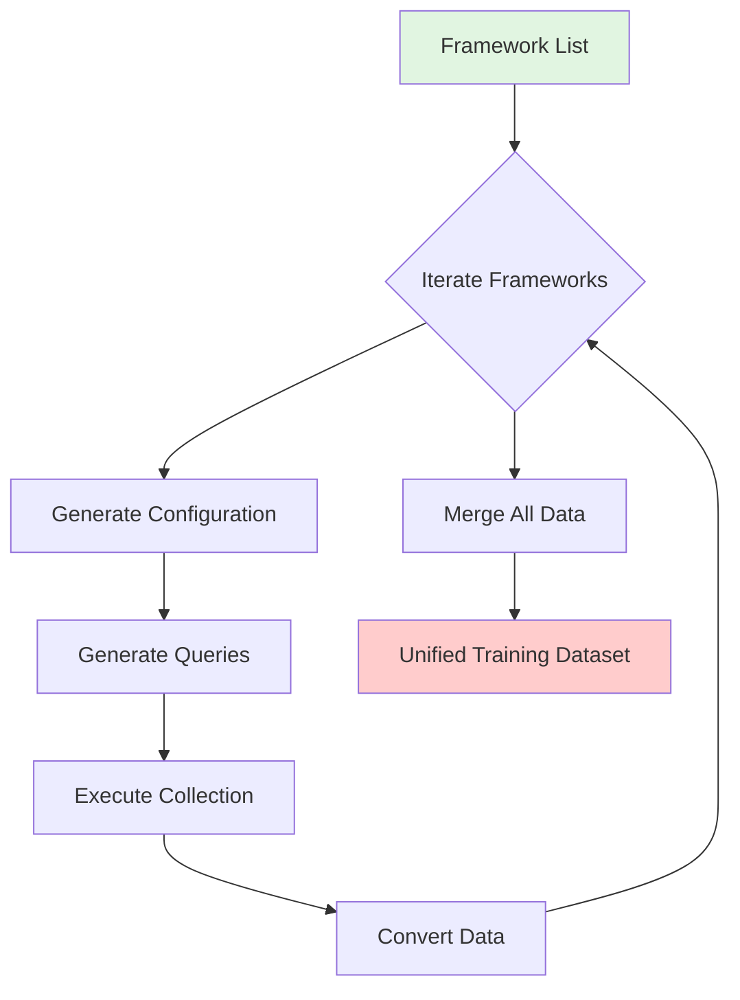
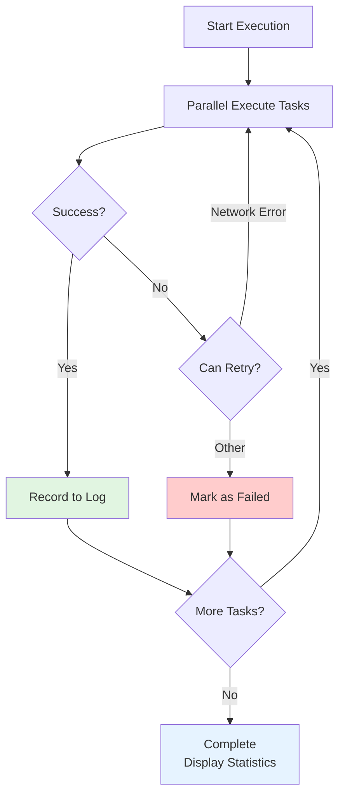

# NexGAP Complete Workflow Diagram

This document provides a visual explanation of the complete NexGAP workflow.

---

## 🔄 End-to-End Workflow



---

## 📊 Data Flow Details

### Phase 1: Agent Creation

**Tool**: NexA4A



**Input**:
- User requirement description (natural language)

**Output**:
```
src/created_frameworks/your_framework/
├── your_framework.yaml          # Framework configuration
├── agents/                      # Agent definitions
│   ├── agent1.yaml
│   └── agent2.yaml
└── tools/                       # Tool implementations (if custom)
    └── custom_tool.py
```

---

### Phase 2: Configuration Generation

**Tool**: GyrfalconFrameworkGenerator (recommended) or manual creation



**4 Configuration Files Explained**:

1. **config.json** - Framework core configuration
```json
{
  "framework_name": "...",
  "agents": [...],  // Agent definitions
  "tools": [...]    // Tool definitions
}
```

2. **framework_config.yaml** - Metadata
```yaml
framework:
  name: ...
  description_en: ...
  description_zh: ...
  tags: [...]
```

3. **persona.jsonl** - User personas (500 entries)
```jsonl
{"persona_en": "...", "persona_zh": "..."}
{"persona_en": "...", "persona_zh": "..."}
```

4. **problem_types.json** - Problem type tree
```json
{
  "root": {
    "children": {
      "Type1": {
        "weight": 1.0,
        "children": {...}
      }
    }
  }
}
```

---

### Phase 3: Query Generation

**Tool**: Gyrfalcon



**Output Format** (`queries.jsonl`):
```json
{
  "content": "How to diagnose hypertension?",
  "difficulty": "medium",
  "context": {
    "problem_type": "Disease Diagnosis",
    "persona": "Family Doctor",
    "framework": "medical_diagnostic_assistant"
  },
  "metadata": {
    "generated_at": "2025-11-14T12:00:00",
    "used_web_search": false,
    "fuzzified": false
  }
}
```

**Performance**:
- Serial (1 worker): ~10 queries/min
- Parallel (4 workers): ~34 queries/min (3.4x)
- Parallel (8 workers): ~60 queries/min (6x)

---

### Phase 4: Execution and Collection

**Tool**: run_end_to_end.py



**Parallel Processing**: Use `--max-workers` to control concurrency
- Default: 3 workers
- Recommended: 5-10 workers (depending on system resources)
- Note: No resume from interruption, restart required after interruption

**Output Structure**:
```
output/
├── langfuse_trace/          # Raw Langfuse spans
│   └── framework_traceid_timestamp.jsonl
├── converted_trace/         # ChatCompletion format (default NexAU XML)
│   └── framework_traceid_timestamp_chatcompletion.jsonl
│   └── framework_traceid_timestamp_chatcompletion_qwen.jsonl  # If --tool-call-format specified
└── logs/                    # Execution log for each query
    └── query_001_framework_timestamp.log
```

---

### Phase 5: Training Data Ready

**Output**: converted_trace/ (ChatCompletion format)



**Final Training Data Format**:
```json
{
  "messages": [
    {
      "role": "user",
      "content": "How to diagnose hypertension?"
    },
    {
      "role": "assistant",
      "content": null,
      "tool_calls": [
        {
          "id": "call_abc123",
          "type": "function",
          "function": {
            "name": "search_medical_database",
            "arguments": "{\"query\": \"hypertension diagnostic criteria\"}"
          }
        }
      ]
    },
    {
      "role": "tool",
      "tool_call_id": "call_abc123",
      "content": "Hypertension diagnostic criteria: Systolic BP ≥140mmHg or Diastolic BP ≥90mmHg..."
    },
    {
      "role": "assistant",
      "content": "According to medical database query results, hypertension diagnostic criteria are..."
    }
  ],
  "metadata": {
    "trace_id": "cm4a5b2c1...",
    "framework": "medical_diagnostic_assistant",
    "difficulty": "medium",
    "quality_score": 0.95
  }
}
```

---

## 🔀 Alternative Workflows

### Workflow A: Minimal Flow (Test Single Query)



**Use Case**: Quick test of agent functionality

---

### Workflow B: Skip Agent Creation (Use Existing Framework)



**Use Case**: Already have framework, only need to generate training data

---

### Workflow C: Batch Process Multiple Frameworks



**Use Case**: Large-scale data generation

---

## 📈 Performance Considerations

### Parallelization Strategy

| Phase | Tool | Parallelization | Recommended Config |
|------|------|--------|----------|
| 1. Agent Creation | NexA4A | ❌ Serial | - |
| 2. Config Generation | GyrfalconFrameworkGenerator | ❌ Serial | - |
| 3. Query Generation | Gyrfalcon | ✅ Multi-process | 4-8 workers |
| 4. Execution Collection | run_end_to_end | ✅ Multi-thread | 3-10 workers (--max-workers) |
| 5. Format Conversion | Automatic (embedded in run_end_to_end) | ✅ Automatic | No configuration needed |

### Resource Consumption Estimate

**Complete workflow for generating 1000 queries**:
- **Time**: ~2-3 hours (including execution)
- **API Calls**:
  - Gyrfalcon: ~1000 LLM calls
  - Agent execution: ~1000-5000 (depending on agent complexity)
- **Storage**: ~500MB - 2GB (depending on trace size)
- **Cost**: $10-50 (depending on model and token usage)

---

## 🛠️ Fault Recovery

### Fault Tolerance Mechanism for Each Phase



**Fault Tolerance by Phase**:
- ✅ **Gyrfalcon**: Failed query generation will automatically retry
- ⚠️ **run_end_to_end**: No automatic resume from interruption, need to restart after interruption
  - Suggestion: Use `--max-workers` to accelerate execution
  - Suggestion: Start with `--max-queries 10` for testing
- ✅ **Converter**: Automatically integrated, XML validation filters error records

**View Logs**:
```bash
# View all logs in real-time
tail -f output/*/logs/*.log

# View log for specific query
cat output/framework/logs/query_001_framework_timestamp.log
```
