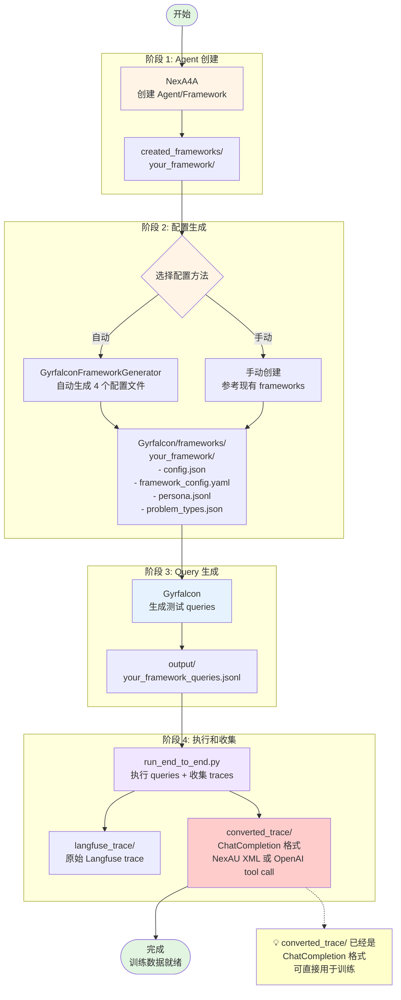

# NexGAP 工作流程

[English](workflow.md) | [中文](#)

本文档介绍 NexGAP 的完整工作流程。

---

## 🔄 端到端工作流程



---

## 📊 各阶段说明

### 阶段 1：Agent 创建

使用 NexA4A 创建 agent framework。

**输入**：需求描述（自然语言）

**输出**：
```
src/created_frameworks/your_framework/
├── your_framework.yaml          # Framework 配置
├── agents/                      # Agent 定义
└── tools/                       # Tool 实现
```

---

### 阶段 2：配置生成

为 Gyrfalcon 生成 framework 配置文件。

**方法**：
- **自动**：使用 GyrfalconFrameworkGenerator sub-agent 自动生成
- **手动**：参考现有 frameworks 手动创建

**输出**（4 个配置文件）：
1. **config.json** - Framework 核心配置
2. **framework_config.yaml** - 元数据和描述
3. **persona.jsonl** - 用户 personas（500 条）
4. **problem_types.json** - 问题类型树

---

### 阶段 3：Query 生成

使用 Gyrfalcon 生成测试 queries。

**输入**：阶段 2 生成的 4 个配置文件

**过程**：
1. 从 problem_types.json 采样问题类型
2. 从 persona.jsonl 采样用户角色
3. 分配难度等级（easy/medium/hard）
4. 使用 LLM 生成 query
5. 可选：Web search 增强、模糊化处理

**输出**：`queries.jsonl`

---

### 阶段 4：执行和收集

执行 queries 并收集 traces。

**过程**：
1. 使用 NexA4A 执行 query
2. 捕获 trace_id
3. 从 Langfuse 获取完整 trace
4. 保存原始 trace 到 `langfuse_trace/`
5. 转换为 ChatCompletion 格式
6. 进行 XML 验证（如果使用 NexAU XML 格式）
7. 可选：转换为特定模型格式（如 qwen）

**输出结构**：
```
output/
├── langfuse_trace/          # 原始 Langfuse spans
├── converted_trace/         # ChatCompletion 格式
└── logs/                    # 执行日志
```

**最终训练数据格式**：
```json
{
  "messages": [
    {"role": "user", "content": "..."},
    {"role": "assistant", "tool_calls": [...]},
    {"role": "tool", "content": "..."},
    {"role": "assistant", "content": "..."}
  ],
  "metadata": {
    "trace_id": "...",
    "framework": "...",
    "difficulty": "medium"
  }
}
```

---

## 🔀 备选工作流程

### 最小流程 - 测试单个 Query

```
NexA4A → 手动输入 Query → 查看输出
```

适用场景：快速测试 agent 功能

### 跳过 Agent 创建 - 使用现有 Framework

```
现有 Framework → 生成配置 → Gyrfalcon → run_end_to_end
```

适用场景：已有 framework，只需生成训练数据

### 批量处理 - 多个 Frameworks

```
Framework 列表 → 循环处理 → 合并数据 → 统一训练数据集
```

适用场景：大规模数据生成

---

## 📝 使用建议

### 并行处理

**Query 生成阶段**：
- 使用 `--num-workers` 参数控制并发
- 推荐：4-8 workers

**执行收集阶段**：
- 使用 `--max-workers` 参数控制并发
- 推荐：5-10 workers

### 开发测试

开始时使用小批量测试：
```bash
# 测试 Query 生成
uv run main.py --framework my_framework --num-queries 10

# 测试完整流程
uv run run_end_to_end.py --max-queries 10 --max-workers 3
```

### 生产运行

确认无误后再进行大规模生成：
```bash
# 生成大量 queries
uv run main.py --framework my_framework --num-queries 500 --num-workers 8

# 完整执行
uv run run_end_to_end.py --max-workers 10
```

---

## 🔗 相关文档

- [主文档](README_cn.md) - 安装和快速开始
- [Converter 工具](converter_cn.md) - Trace 处理详情
- [Gyrfalcon 使用](gyrfalcon_cn.md) - Query 生成详情
